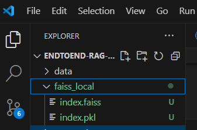

# Data Engineering FAQ's with RAG using Bedrock


## Overview
This Project depicts the easy and programmatical approach to create a User intterface where a user can ask questions regarding Data Engineering using Large Language Models(LLM's) using Langchain framework and Amazon BedRock!

## Technologies Used
- Langchain // Framework
- Amazon BedRock // Amazon Service to access all LLM's
- Streamlit // Develop FrontEnd UI for interaction.


# How to run the application.

- conda create -n llmapp python=3.8 -y //Create a new environment
- conda activate llmapp //Activate the environment
- pip install -r requirements.txt //Install the requirements package
- pip install -U langchain-community //Install Langchain community
- streamlit run main.py //run application using Streamlit

# Packages needed to be imported.

```python
import boto3    # It is AWS client used to interact with Amazon Web Services.
import streamlit as st    # Used to develop FrontEnd for User interaction.
from langchain.llms.bedrock import Bedrock    # Amazon Service to access all LLM's using API.
from langchain.embeddings import BedrockEmbeddings    # To choose an embedding model among available in BedRock.
from langchain.document_loaders import PyPDFDirectoryLoader    # Used to load the PDF files to feed our KnowledgeBase.
from langchain.text_splitter import RecursiveCharacterTextSplitter    # This helps in creating the Chunks for our embedding model as it can take only limited tokens at once.
from langchain.vectorstores import FAISS    # Acts as a VectorDB/KnowledgeBase to store the vectors/embeddings which can later be accessed by our LLM.
from langchain.prompts import PromptTemplate    # Promot given to our LLM Application, refers how our application should work.
from langchain.chains import RetrievalQA    # Since this application is a question and answer type, we use RetrievalQA.
```

# 1.1 Create a PromptTemplate for the GenAI app.
below is the template to give a prompt for our LLM app. This can be modefied as per the functionality we need and how we want our app to behave.

```python
prompt_template = """

Human: Use the folowing pieces of the context to provide a
cocise answer to the question at the end also use atleast 250 words to summarize
and explain your answer in detail. If you do not know the answer, just say that 
"Can't answer this question with the knowledge I have", but do not try to make up answers.
<context>
{context}
</context>

Question: {question}

Assistant:"""
```

# 1.2 Initialize the prompt template.
```python
PROMPT = PromptTemplate(
    template=prompt_template, input_variables=["context", "question"]
)
```

# 2.Bedrock client setup.
```python
bedrock = boto3.client(service_name='bedrock-runtime', region_name='us-east-1')
```

# 3.Get embeddings model from Bedrock.
```python
bedrock_embedding = BedrockEmbeddings(model_id="amazon.titan-embed-text-v1", client=bedrock)
```


# 4. Function to create Chunks to feed into embedding model.
```python
def get_documents():
    loader = PyPDFDirectoryLoader("Data")
    documents = loader.load()
    text_splitter = RecursiveCharacterTextSplitter(
                                    chunk_size=1000, 
                                    chunk_overlap=500)
    docs = text_splitter.split_documents(documents)
    return docs
```

# 5. Function to get the vectors/embeddings from the chunks and save the vectors/embedding/vectorDB to local to use it for later.
```python
def get_embeddings(docs):
    vectoestore_faiss = FAISS.from_documents(
                                    docs,
                                    bedrock_embedding
    ) 
    vectoestore_faiss.save_local("faiss_local")
```

# 6. Function to define llm.
```python
def get_llm():
    llm = Bedrock(model_id = "mistral.mistral-7b-instruct-v0:2", client = bedrock)
    return llm
```


# 7. Function to get the llm response.
```python
def get_llm_response(llm, vectoestore_faiss, query):
    #The RetrievalQA will help to connect the llm to the knowledge base and also the query user asked.
    qa = RetrievalQA.from_chain_type(
         llm = llm,
         chain_type = "stuff", # there are multiple chain types like "stuff", "refine" etc.
         retriever = vectoestore_faiss.as_retriever(
         search_type="similarity", search_kwargs={"k": 3}), # if we user vecotDB we need to use similarity search.

         return_source_documents=True, # this will return the documents which contain the answer
         chain_type_kwargs={"prompt": PROMPT})

    response = qa({"query": query})
    return response['result']
```

# Main function.
```python
def main():
    st.set_page_config("RAG")
    st.header("Data Engineering FAQ's with RAG using Bedrock")

    user_question = st.text_input("Ask a Question regarding Data Engineering")

    with st.sidebar:
        st.title("Create Knowledge Base once! Ask questions anytime!")

        if st.button("Store Vector"):
            with st.spinner("processing..."):
                docs = get_documents()
                get_embeddings(docs)
                st.success("Done")

        if st.button("Send"):
            with st.spinner("processing..."):
                faiss_index = FAISS.load_local("faiss_local",
                                               bedrock_embedding, 
                                               allow_dangerous_deserialization=True)
                llm = get_llm()
                st.write(get_llm_response(llm, faiss_index, user_question))


if __name__ == "__main__":
    main()
```

# How the UI works.

- Initial look of the UI.


- Once the app is launched we click the Store Vector button, which in the back end collects the pdf document from the 'data' folder then uses the embedding model to create the vectors and save it in the 'faiss_local' folder.


- Once the buton is clicked it will take time to process.


- Once the process is clompleted it show 'Done'


- If we check the project folder two files with binary code will be created, which is our 'KNOWLEDGE BASE' with embeddings/vectors.


- I provided the query and hit the 'send' button which will with in no time return me the response according to the prompt given to my app.


#End of the Application


